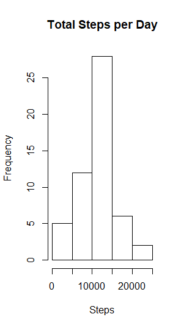
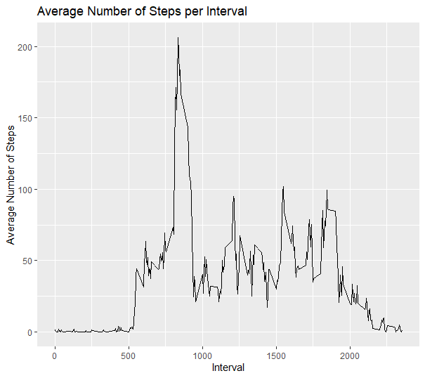
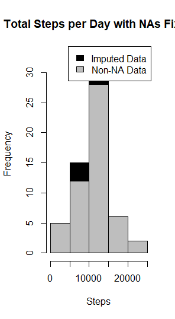
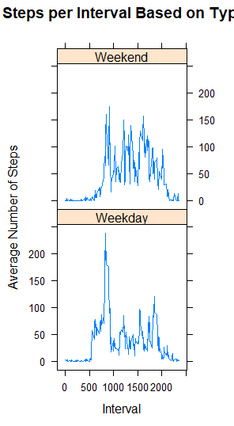

##1. Code for reading in the dataset and/or processing the data

```
activity <- read.csv("activity.csv")
```
```
activity$day <- weekdays(as.Date(activity$date))
activity$DateTime<- as.POSIXct(activity$date, format="%Y-%m-%d")
```
```
clean <- activity[!is.na(activity$steps),]
```

## 2. Histogram of the total number of steps taken each day

**Total number of steps**
```
sumTable <- aggregate(activity$steps ~ activity$date, FUN=sum, )
colnames(sumTable)<- c("Date", "Steps")
```
**Creating the Histogram**
```
hist(sumTable$Steps, breaks=5, xlab="Steps", main = "Total Steps per Day")
```



## 3. Mean and median number of steps taken each day

**Mean of Steps**
```
as.integer(mean(sumTable$Steps))
```
Mean= 10766

**Median of Steps**
```
as.integer(median(sumTable$Steps))
```
Median=10765


## 4. Time series plot of the average number of steps taken

```
library(plyr)
library(ggplot2)

clean <- activity[!is.na(activity$steps),]

**Average steps per interval**
intervalTable <- ddply(clean, .(interval), summarize, Avg = mean(steps))

**Line plot of average steps per interval**
p <- ggplot(intervalTable, aes(x=interval, y=Avg), xlab = "Interval", ylab="Average Number of Steps")
p + geom_line()+xlab("Interval")+ylab("Average Number of Steps")+ggtitle("Average Number of Steps per Interval")
```



## 5. The 5-minute interval that, on average, contains the maximum number of steps

**Maximum steps by interval**
```
maxSteps <- max(intervalTable$Avg)
```

**Interval with maximum average number of steps**
```
intervalTable[intervalTable$Avg==maxSteps,1]
```
5 minute interval with maximum number of steps=835


## 6. Code to describe and show a strategy for imputing missing data

**NAs in original data set**
```
nrow(activity[is.na(activity$steps),])
```
Number of NAs=2304

**Average number of steps per weekday and interval**
```
avgTable <- ddply(clean, .(interval, day), summarize, Avg = mean(steps))
```

**Dataset with all NAs for substitution**
```
nadata<- activity[is.na(activity$steps),]
```

**Merge NA data with average weekday interval**
```
newdata<-merge(nadata, avgTable, by=c("interval", "day"))
```


**Reordering the new substituded data**
```
newdata2<- newdata[,c(6,4,1,2,5)]
colnames(newdata2)<- c("steps", "date", "interval", "day", "DateTime")
```

**Merging the NA averages and non NA data together**
```
mergeData <- rbind(clean, newdata2)
```

**To compare with step 1**
```
sumTable2 <- aggregate(mergeData$steps ~ mergeData$date, FUN=sum, )
colnames(sumTable2)<- c("Date", "Steps")
```

**Mean of Steps**
```
as.integer(mean(sumTable2$Steps))
```
Mean=10821

**Median Steps**
```
as.integer(median(sumTable2$Steps))
```
Median=11015


## 7. Histogram of the total number of steps taken each day after missing values are imputed
```
hist(sumTable2$Steps, breaks=5, xlab="Steps", main = "Total Steps per Day with NAs Fixed", col="Black")
hist(sumTable$Steps, breaks=5, xlab="Steps", main = "Total Steps per Day with NAs Fixed", col="Grey", add=T)
legend("topright", c("Imputed Data", "Non-NA Data"), fill=c("black", "grey") )
```


## 8. Panel plot comparing the average number of steps taken per 5-minute interval across weekdays and weekends

**New category based on the days of week**
```
mergeData$DayCategory <- ifelse(mergeData$day %in% c("Saturday", "Sunday"), "Weekend", "Weekday")
library(lattice) 
```

**Summarize data by interval and type of day**
```
intervalTable2 <- ddply(mergeData, .(interval, DayCategory), summarize, Avg = mean(steps))
```

**Plot data in panel plot**
```
xyplot(Avg~interval|DayCategory, data=intervalTable2, type="l",  layout = c(1,2), main="Average Steps per Interval Based on Type of Day", ylab="Average Number of Steps", xlab="Interval")
```
  


